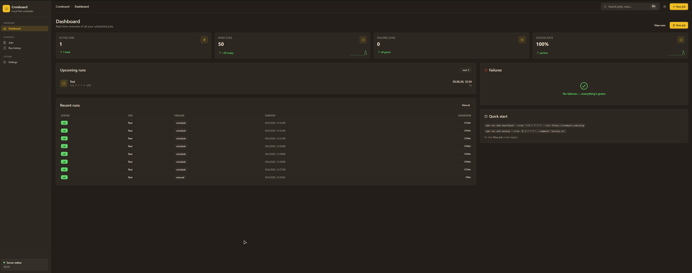

# st-cron-webhook-trigger

A **local-first cron scheduler** with a **Gruvbox-themed web UI** for triggering webhooks, scripts, and shell commands on a schedule. Built as a single small Node.js process — no cloud account, no telemetry, your jobs and run history live in `~/.config/cronboard/`.

> **Status:** v0.2.0 — DaisyUI Gruvbox redesign, cron import-from-curl, real calendar/clock pickers, full SDD governance.

---

## 🤔 Why this exists

I built this because I needed to **trigger [Langflow](https://www.langflow.org/) workflows on a cron schedule via webhook** — and there was no good local-first way to do that.

Langflow itself has no scheduler. Hosted cron services (cron-job.org, EasyCron, GitHub Actions cron, etc.) all work, but they require you to push your webhook URLs and secrets into someone else's cloud. For a workflow that's already running on **my** infrastructure (Langflow at `<your-langflow-host.example>`), handing the trigger to a third party felt wrong — and the third parties also charge per execution.

`st-cron-webhook-trigger` is the missing piece: a tiny cron daemon I run on my own machine that fires the webhook at the right moment. It stores everything (jobs, runs, logs) in `~/.config/cronboard/` as plain JSON, runs the schedule with Croner, and ships every webhook request with full request/response capture so I can debug failures locally without leaving the terminal.

### Concrete flow

```
┌────────────────┐      ┌───────────────────────┐      ┌─────────────────────┐
│   cronboard    │      │      Langflow         │      │  Langflow workflow   │
│  (this repo)   │ ───► │   langflow.steimer-   │ ───► │  "summarize-emails" │
│  */5 * * * *  │ POST │   cloud.xyz           │      │  (LLM chain, tools, │
│                │      │   /api/v1/webhook/…   │      │   memory, etc.)      │
└────────────────┘      └───────────────────────┘      └─────────────────────┘
        ▲                                                    │
        └──────── 200 OK / 403 / 500 (with full body) ──────┘
```

Same pattern works for any web-accessible automation: n8n, Pipedream triggers, your own FastAPI/Express/Go service, a Discord/Slack webhook, an OpenAI Assistants endpoint, a Grafana annotated event, etc. The point is: **the schedule stays on your machine, the trigger goes wherever you want**.

---

## ✨ Features

- **Visual schedule builder** — pick *Every minute / Hourly / Daily / Weekly / Monthly / Custom* in a modal with live preview of the next 5 runs.
- **Real calendar picker** for weekly/monthly recurrences (powered by `react-day-picker` v9) — click a date to toggle its weekday or set day-of-month.
- **Real time picker** (powered by `react-aria-components`) for HH:MM.
- **Two action types out of the box:**
  - **Webhook** — HTTP method/URL/headers/body with timeout + optional retry/backoff.
  - **Shell** — local command with cwd + timeout + optional `allowedPaths` allowlist.
- **Import from curl** — paste any `curl` command into a modal; we extract method, URL, headers, body in one click.
- **Run history** — last 1000 runs with status, duration, full Request/Response/Error details.
- **Live preview** of the next 5 runs in the schedule modal and on the Dashboard.
- **Daemon mode** — `npm start` detaches with a PID file; `npm stop` sends SIGTERM with a 3-second SIGKILL fallback.
- **Local-first** — default bind `127.0.0.1`, no auth required; `--host 0.0.0.0` requires `--token`.
- **Hardened for Windows** — atomic JSON writes via temp+rename with 5× exponential-backoff retry (handles antivirus locking).
- **Full SDD governance** under `openspec/` with append-only change history.

---

## 📸 Dashboard



*Captured from a live `v0.3.0` instance: 1 active job (`Test` at `*/1 * * * *`), 50 successful runs in the last 24h, 0 failures, 100% success rate over 50 runs.*

---------------------------------------------+
| Cronboard                       [edit]      |
|-----------------------------------------------|
| Active jobs  | Runs (24h)  | Failures | SR   |
|     3        |    42       |    0     | 100% |
|-----------------------------------------------|
| Upcoming runs                             ──  |
|  ⚡ heartbeat        */5 * * * *  next 14:35 |
|  🔔 daily-report     0 9 * * *   next 09:00 |
|-----------------------------------------------|
| Recent runs                                    |
|  ✓ heartbeat   schedule  14:30   12ms       |
|  ✓ heartbeat   schedule  14:35   11ms       |
+---------------------------------------------+
```

---

## 🚀 Quick Start

```bash
git clone https://github.com/steimbyte/st-cron-webhook-trigger.git
cd st-cron-webhook-trigger
npm install                # 341 packages, ~30s

# Dev mode (Vite :5173 + backend :3737 with hot reload)
npm run dev

# Production mode
npm run build              # builds the web bundle into packages/core/dist/web
npm start                  # starts the daemon on :3737 (detached)
```

Open <http://127.0.0.1:3737> in your browser. The dashboard shows your jobs, upcoming runs, and a quick-start card with example CLI commands.

### CLI

```bash
npm start [--port 3737] [--host 127.0.0.1] [--token SECRET]
          [--data DIR] [--detach|--no-detach]

npm run stop                              # SIGTERM with 3s SIGKILL fallback
npm run status                            # pid, url, job count, recent runs
npm run logs [-n 200] [-f]                # tail the structured log file

# One-off job management (does not require a running daemon)
npm run add NAME --cron '*/5 * * * *' --url https://example.com/ping
npm run add NAME --cron '0 9 * * 1-5' --command 'backup.sh'
npm run ls
npm run rm NAME
npm run run NAME                          # manual trigger via CLI
```

Default data directory: `~/.config/cronboard/` (override via `CRONBOARD_DATA_DIR` env or `--data DIR`).

---

## 🏗️ Architecture

Single Node process that runs three things concurrently:

```
┌─────────────────────────────────────────────┐
│ cronboard (one Node process, optionally     │
│ detached as a daemon)                       │
│                                             │
│   ┌──────────────┐  ┌──────────────────┐     │
│   │  Croner      │  │  Fastify HTTP    │     │
│   │  Scheduler   │  │  + Static UI     │     │
│   │  - mtime cache  │  :3737            │     │
│   │  - 80ms debounce │                  │     │
│   │  - re-entry     │                  │     │
│   │    guard       │                  │     │
│   └──────┬───────┘  └────────┬─────────┘     │
│          │                   │             │
│          ▼                   ▼             │
│   ┌──────────────────────────────┐         │
│   │ JSON store (atomic writes,    │         │
│   │ EPERM retry, per-file mutex)  │         │
│   │ jobs.json / runs.json / log   │         │
│   └──────────────────────────────┘         │
│                                             │
│   Actions:  webhook (undici)                │
│             shell (child_process exec)     │
└─────────────────────────────────────────────┘
```

### Stack

| Layer | Choice |
|---|---|
| Language | TypeScript (strict, ESM) |
| Backend | Node 20+ · Fastify · @fastify/static · @fastify/cors |
| Cron | Croner (TS-native Job API) |
| HTTP client (webhooks) | undici |
| Validation | Zod |
| CLI | Commander |
| Logging | pino (structured, file + TTY when interactive) |
| Cron text → English | cronstrue |
| Frontend | Vite 5 · React 18 · **DaisyUI 5** + Tailwind 4 · Radix Icons |
| Theme | Gruvbox (warm earth-tone palette) — strict colors, **no transparency** |
| Date picker | react-day-picker v9 (month-view calendar) |
| Time picker | react-aria-components TimeField (segmented HH:MM) |
| Router | none (state-based view switching) |
| Cron expression logic | `packages/core/src/scheduler/cronExpr.ts` (pure functions, single source of truth) |
| Storage | JSON files in `~/.config/cronboard/` |

---

## 📦 Storage

JSON files in `~/.config/cronboard/`:

```
~/.config/cronboard/jobs.json          # array of jobs
~/.config/cronboard/runs.json          # array of runs (capped at 1000, oldest dropped)
~/.config/cronboard/cronboard.log      # structured pino logs
~/.config/cronboard/cronboard.pid      # daemon PID + start metadata
```

Writes go through `temp file → rename()` with **5× exponential-backoff retry** (50ms → 400ms) on Windows `EPERM`/`EACCES`/`EBUSY` (the standard transient antivirus / indexer lock). Last resort falls back to direct overwrite. Reads are guarded by a per-file mutex to prevent torn writes.

---

## 📡 HTTP API

```
GET    /api/health                      # { status, version, time }
GET    /api/jobs                        # list jobs
POST   /api/jobs                        # create (body: { name, cronExpression, timezone, enabled, actions })
GET    /api/jobs/:id                    # fetch one
PATCH  /api/jobs/:id                    # update
DELETE /api/jobs/:id                    # delete (run history is preserved)
POST   /api/jobs/:id/toggle             # flip enabled flag
POST   /api/jobs/:id/run                # manual trigger
GET    /api/jobs/:id/runs               # list runs for one job
GET    /api/runs                        # list recent runs (?jobId=, ?limit=)
GET    /api/runs/:id                    # fetch one run with action details
GET    /api/cron/describe?expr=...      # human description via cronstrue
GET    /api/cron/next?expr=...&tz=...   # next N run times for a cron expression
```

All `/api/*` calls return JSON. When bound to non-localhost, an `Authorization: Bearer <token>` header is required.

---

## 🔐 Security

- **Default bind:** `127.0.0.1` — no auth needed for local-only use.
- **`--host 0.0.0.0`** requires `--token`; bearer auth enforced on every `/api/*` call.
- **Webhook actions** honour a per-action timeout (default 30 s) and optional retry/backoff strategy.
- **Shell actions** honour a per-action timeout (default 60 s) and optional `allowedPaths` allowlist. UI shows a soft warning before adding a shell action.
- **No `npm publish`** — both packages are `private: true`.

---

## ⏱️ Reliability

The scheduler self-reschedules only on real file changes, not its own writes:

- `mtime` cache tracks the last value we wrote.
- 80 ms debounce coalesces multi-event bursts from `fs.watch`.
- `syncInFlight` flag prevents re-entry.
- `setRunMeta` only writes when `nextRunAt` actually changed.

The webhook executor captures the full `request: { method, url, body }` and `response: { status, headers, body }` on **both** success and failure paths — failed runs are immediately diagnosable from the UI's run-details drawer.

---

## 🛠️ Development

```bash
npm install             # 341 packages, ~30s
npm run dev             # Vite :5173 + tsx watch :3737 (concurrently)
npm run build           # tsc (web) --noEmit + vite build + copy-web into core/dist/web
npm start               # tsx packages/core/src/cli.ts start (detached)
```

### Tests

```bash
node --test --import tsx packages/core/src/scheduler/cronExpr.test.ts   # 63 unit tests
npx tsx packages/web/src/lib/curlParser.ts                              # 7 curl-parser tests
powershell -ExecutionPolicy Bypass -File scripts/smoke-ui.ps1            # end-to-end
npm run typecheck                                                           # core + web
```

### Layout

```
st-cron-webhook-trigger/
├── package.json              # workspace root (npm workspaces)
├── tsconfig.base.json
├── packages/
│   ├── core/                 # CLI + scheduler + server + storage + actions
│   │   ├── package.json
│   │   ├── tsconfig.json
│   │   └── src/
│   │       ├── cli.ts        # commander entry point
│   │       ├── server.ts     # Fastify app factory
│   │       ├── scheduler/    # Croner wrapper + runner
│   │       ├── store/        # JSON-file repo
│   │       ├── actions/      # webhook + shell executors
│   │       ├── schemas.ts
│   │       ├── types.ts
│   │       ├── config.ts
│   │       ├── logger.ts
│   │       └── daemon.ts
│   └── web/                  # Vite + React + DaisyUI
│       ├── package.json
│       ├── tsconfig.json
│       ├── vite.config.ts
│       ├── index.html
│       └── src/
│           ├── main.tsx
│           ├── App.tsx
│           ├── styles.css
│           ├── lib/
│           │   ├── api.ts
│           │   └── curlParser.ts
│           ├── components/
│           │   ├── CronBuilder.tsx
│           │   └── Calendar.tsx
│           └── pages/        # Dashboard, Jobs, Editor, Runs, Settings
├── openspec/                 # SDD change history (append-only)
│   ├── config.yaml
│   └── changes/
│       └── archive/
└── scripts/                  # typecheck + smoke PowerShell scripts
```

---

## 📐 SDD Governance

This project follows OpenSpec / Spec-Driven Development. The single source of truth is `openspec/config.yaml`. SDD-enforced rules:

- `radix-themes-only` — DaisyUI is the sole UI library; no Tailwind utility classes, no other component framework.
- `windows-aware-storage` — temp+rename with EPERM retry + per-file mutex.
- `private-monorepo` — both packages `private: true`; no `npm publish`.
- `node-20-only` — `engines.node >= 20`.
- `local-first-default-bind` — `127.0.0.1` unless `--token` provided.
- `strict-typescript` — strict + ESM; no unjustified `any`, no `// @ts-ignore` without a linked issue.
- `test-coverage-gap-disclosed` — first `*.test.ts` added in v0.2 (63 cases, all green).

Archived changes live under `openspec/changes/archive/` — append-only.

---

## 🤖 AI-Generated Code — Disclosure

This codebase was **written predominantly by an AI coding assistant** (Pi, powered by a frontier model) under the direction of the project owner. Specifically:

- **Initial scaffolding (v0.1.0)** — Radix Themes + Fastify + Croner + JSON-store + smoke tests.
- **Phase 11 redesign (v0.1.0 → v0.2.0)** — DaisyUI Gruvbox rewrite of every UI component and page; calendar/clock pickers; cron-state machine refactor.
- **Curl parser + import-from-curl modal** — pure tokenizer + parser with 7 self-tests.
- **CronBuilder rewrite** — modal-based schedule picker replacing the original tab UI; fixed the stale-`useMemo` bug where picking `*/1` silently reset to `*/5`.
- **Webhook debugging improvement** — failure-path response/request capture.
- **Hardening** — Windows-aware atomic writes, EPERM retry, scheduler re-entry guard, file-watcher debounce, signal-handling fallback for Windows.
- **README, .gitignore, SDD artifacts** — generated documentation.

The project owner reviewed, approved, and shipped every change. **All code is provided as-is**, with no warranty. Use at your own risk, especially for production cron jobs — always test schedules manually before relying on them for critical workloads.

---

## 📜 License

MIT — see [LICENSE](./LICENSE).

Copyright (c) 2026 steimbyte